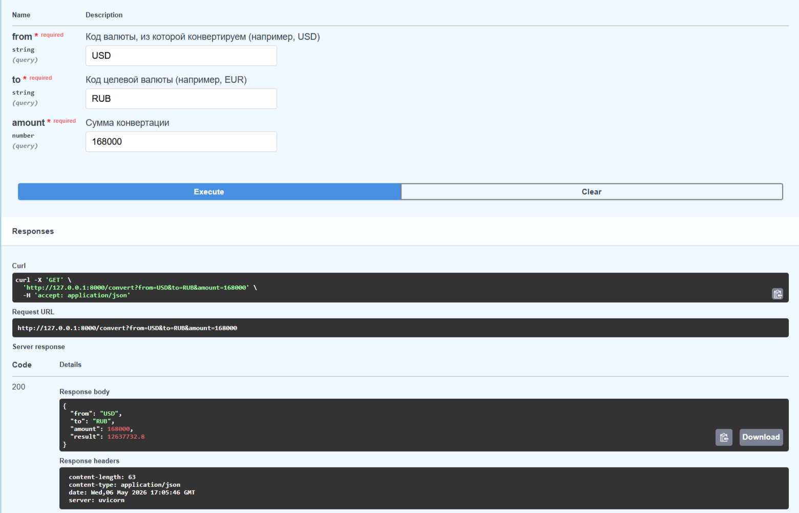

CurrencyViewer - сервис курсов валют

Простой RestAPI сервис, который получает актуальные курсы валют от "Центрального банка РФ", сохраняет их в PostgreSQL и предоставляет эндпоинты для просмотра и конвертации валют.

Стек:
- Python 3.12
- FastAPI
- Unicorn
- PostgreSQL
- psycopg2-bynary
- Reqests
- API ЦБ РФ (https://www.cbr-xml-daily.ru)


Как развернуть проект:

1. Клонировать репозиторий
   
    ```bash
   $ git clone https://github.com/Alminessa/currency-viewer.git
   $ cd currency-viewer
2. Создать виртуальное окружение и установить зависимости:

    ```bash
   $ python -m venv venv
    
   $ source venv/bin/activate      # для Linux/Mac
   $ venv\Scripts\activate         # для Windows
    
   $ pip install -r requirements.txt
3. Настроить базу данных PostgreSQL:
  - Создайте базу данных currency_db
  - Создайте пользователя (например, currency_user) с паролем
  - Выдайте права на схему public (инструкция в pgAdmin)
  - Пропишите параметры подключения в файле config.py

     ```bash
    # Пример config.py:
      DB_HOST = "localhost"
      DB_PORT = 5432
      DB_NAME = "currency_db"
      DB_USER = "currency_user"
      DB_PASSWORD = "ваш_реальный_пароль"
      CBR_API_URL = "https://www.cbr-xml-daily.ru/daily_json.js"
4. Запустить приложение:
   
    ```bash
   $ uvicorn main:app --reload --host 0.0.0.0 --port 8000
Сервис запустится по адресу http://127.0.0.1:8000.
Документация Swagger доступна на http://127.0.0.1:8000/docs.

   Примеры запросов:
   - Получить все курсы на сегодня:
       ```bash
      $ curl http://127.0.0.1:8000/rates
   - Конвертировать 100 USD в EUR:
       ```bash
      $ curl "http://127.0.0.1:8000/convert?from=USD&to=EUR&amount=100"
   - Принудительно обновить курсы в БД:
       ```bash
      $ curl -X POST http://127.0.0.1:8000/update


Как это работает:
1. При запуске приложение подключается к PostgreSQL и создает таблицы (если их нет)
2. Функция update_rates_in_db() запрашивает JSON с курсами у ЦБ РФ, парсит его и сохраняет в базу данных
3. Конвертация валют происходит через рубль:
   - сумма переводится в рубли (amount * курс_валюты_к_рублю)
   - затем рубли переводятся в целевую валюту (рубли + курс_валюты_к_рублю)
4. Все эндпоинты возвращают данные в формате JSON, документация генерируется автоматически (Swagger).


Пример конвертации из USD в RUB:



Контакты:
- GitHub: @Alminessa
- Email: anastasiya_k_12@mail.ru
